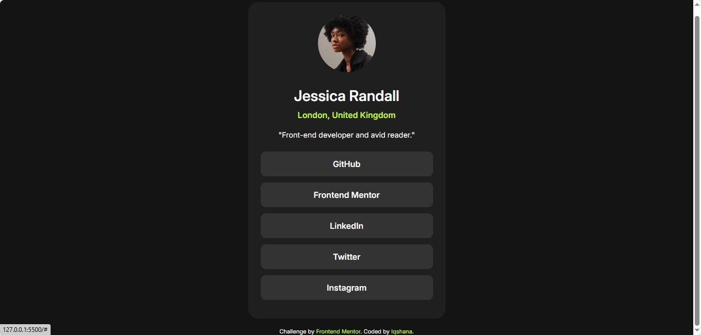

# Frontend Mentor - Social links profile solution

This is a solution to the [Social links profile challenge on Frontend Mentor](https://www.frontendmentor.io/challenges/social-links-profile-UG32l9m6dQ). Frontend Mentor challenges help you improve your coding skills by building realistic projects. 

## Table of contents

- [Overview](#overview)
  - [The challenge](#the-challenge)
  - [Screenshot](#screenshot)
  - [Links](#links)
- [My process](#my-process)
  - [Built with](#built-with)
  - [What I learned](#what-i-learned)
  - [Continued development](#continued-development)
  - [Useful resources](#useful-resources)
- [Author](#author)
- [Acknowledgments](#acknowledgments)

**Note: Delete this note and update the table of contents based on what sections you keep.**

## Overview

The goal of this project was to create a responsive and accessible social profile page that includes interactive links to various social platforms. Using semantic HTML, and transition effects, this project focuses on creating an easy-to-navigate and visually engaging layout. Emphasis was placed on accessibility by implementing keyboard navigation, making sure that all interactive elements are accessible without a mouse.

### The challenge

Each interactive element, such as buttons and links, has a clearly defined hover and focus state. These states are visually distinct, allowing users to easily identify which element is currently active or selected. Careful consideration has been given to color contrast, transition effects, and outline styles, making the interface intuitive and accessible to both mouse and keyboard users.

### Screenshot



### Links

- Live Page URL - [Social_Profile_links](https://anahsqi.github.io/Social_Profile_links/)


## My process

I approached the project by setting up a semantic HTML structure and CSS variables for a cohesive design, focusing on mobile-first responsiveness with Flexbox. Styling included smooth transitions and clear hover and focus states for all interactive elements to enhance usability. Keyboard accessibility was a priority, so I ensured users could navigate the page using the keyboard, with visible focus indicators that complemented the design. After adding subtle transitions, I tested the project across devices and browsers, making final adjustments to ensure a polished, user-friendly experience.


### Built with

- Semantic HTML5 markup
- CSS custom properties
- Flexbox
- Mobile-first workflow

### What I learned


In this project, I deepened my understanding of semantic HTML and learned how it improves accessibility and structure. I also experimented with CSS transitions and hover effects, which enhanced the interactivity of the page. Implementing keyboard accessibility taught me the importance of clear focus indicators, and I became more familiar with setting custom outlines that are both visually appealing and functional. Overall, these techniques made the project more accessible, responsive, and enjoyable to interact with.

```css

.button{
    background-color: var(--Grey700);
    color:var(--White);
    font-size: 1rem;
    font-weight: 600;
    border:none;
    border-radius: 10px;
    padding: 14px;
    margin-bottom: 12px;
    text-decoration: none;
    transition: background-color 0.3s ease, transform 0.3s ease;


}

.button:hover, .button:focus{
    background-color: var(--Green);
    color: var(--Grey900);
    transform: scale(1.05); /* Slightly enlarges the button */
    cursor: pointer;
    outline:none;
}

.button:active{
    background-color: var(--Green);
    color: var(--Grey900);
    transform: scale(0.98); /* Simulates a press */
    outline: 1px solid var(--Grey900);
}
```

### Continued development

In future projects, I aim to further refine my skills in CSS animations and transitions to create even smoother and more engaging user experiences. I also plan to explore advanced accessibility techniques, such as ARIA roles and attributes, to enhance the usability of my web applications for all users. Additionally, I want to experiment with integrating JavaScript for dynamic interactions, improving the overall functionality of my projects. Lastly, I will continue to focus on responsive design principles to ensure my layouts work seamlessly across various devices and screen sizes.

### Useful resources

- [W3C Web Accessibility Guidelines](https://www.w3.org/WAI/WCAG22/quickref/?versions=2.1) - The W3C guidelines were instrumental in ensuring that my project meets accessibility standards, especially regarding keyboard navigation and focus states.
 

## Author

- GitHub - [GitHub/Iqshana](https://github.com/anahsqi)
- Frontend Mentor - [@Anahsqi](https://www.frontendmentor.io/profile/Anahsqi)

## Acknowledgement

I would like to thank the Frontend Mentor community for their continuous support and inspiration. Their feedback on my project was invaluable, helping me refine my coding skills and enhance the overall design. Additionally, I appreciate the resources and tutorials available online, which guided me through various challenges I faced during the implementation, especially in areas like CSS transitions and keyboard accessibility. A special shoutout to fellow developers who shared their insights and solutions, which motivated me to improve my approach to this project.
